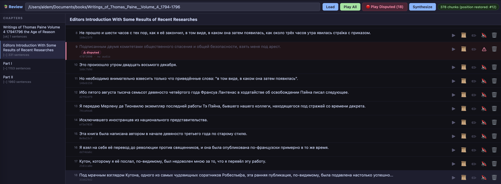

# EPUB/FB2 to Audiobook Converter

A fork of [p0n1/epub_to_audiobook](https://github.com/p0n1/epub_to_audiobook).

**Mission:** Practical self-hosted audiobook production with focus on quality.
This fork extends the original toward a more complete workflow — richer input format support,
more TTS backend choices, and a sophisticated Russian text normalization pipeline tuned for
high-quality synthesis with XTTS and other self-hosted models.

**Supported input formats:** EPUB, FB2.

> **License notice:** All new code introduced in this fork is distributed under the
> [PolyForm Noncommercial License 1.0.0](https://polyformproject.org/licenses/noncommercial/1.0.0/).
> Files carried over from upstream contributors retain their original licenses.

---

## Recommended Self-Hosted TTS Servers

This fork is primarily tested against the author's own Windows-friendly TTS servers.
Rather than requiring a synchronous OpenAI-compatible endpoint, all three use a **configurable
polling job API** — submit a job, poll for readiness, download the result — which works well
with longer synthesis tasks and does not block the client.

| Server | Model | Notes                                                                                  |
|---|---|----------------------------------------------------------------------------------------|
| [alboro/cozy-voice-win-jobs](https://github.com/alboro/cozy-voice-win-jobs) | Cozy Voice | **Best overall results.** Best speed & quality proportion among these polling servers. |
| [alboro/xtts-win-jobs](https://github.com/alboro/xtts-win-jobs) | XTTS v2 | Solid multilingual TTS. Stable result in Russian with voice cloning.                   |
| [alboro/qwen-win-jobs](https://github.com/alboro/qwen-win-jobs) | Qwen TTS | Better then XTTS quality, but not stable voice among different requests.               |

The polling approach is configured via the `[tts.openai]` INI section — see `config.example.ini`
for the full set of `openai_submit_url`, `openai_status_url_template`,
`openai_download_url_template`, and related options.

---

## What's new in this fork

### TTS Providers

In addition to the original Azure / Edge / OpenAI / Piper backends:

| Provider | Origin | Notes |
|---|---|---|
| **Qwen3** (`--tts qwen`) | [7enChan/reson](https://github.com/7enChan/reson) | Aliyun DashScope API. Supports Russian. Optional dep: `dashscope`. |
| **Gemini** (`--tts gemini`) | [7enChan/reson](https://github.com/7enChan/reson) | Google GenAI SDK. Multi-speaker map support. Optional dep: `google-genai`. |
| **Kokoro** (`--tts kokoro`) | [kroryan/epub_to_audiobook](https://github.com/kroryan/epub_to_audiobook) | [Kokoro-FastAPI](https://github.com/remsky/Kokoro-FastAPI) backend with voice mixing. |

### FB2 Input Support

Native parsing of FB2 fiction format — sections, poems, footnotes, metadata.

### Russian Text Normalization Pipeline

A pipeline of composable normalizer steps (see [Normalizer steps](#normalizer-steps) below).
Numbers, initials, abbreviations, stress disambiguation via LLM, proper nouns, safe sentence
splitting, and more.

Stress data is sourced from the bundled `tsnorm` dictionary and optionally from
[gramdict/zalizniak-2010](https://github.com/gramdict/zalizniak-2010) (~110k lemmas, CC BY-NC),
cached locally in SQLite.

### Structured Pipeline Modes

| Mode | What it does |
|---|---|
| `prepare` | Parse + normalize → write per-chapter `.txt` files for human review |
| `audio` | Synthesize audio from reviewed `.txt` (or raw book text); normalizers are skipped |
| `audio_check` | Verify synthesized chunks via Whisper — low-similarity chunks are marked **disputed** for review; already-checked chunks are cached and skipped on reruns |
| `package` | For chapters where all per-sentence chunks are present: rebuild chapter audio from chunks. For chapters with incomplete chunks: use existing chapter audio files. Then package everything into `.m4b`. |
| `all` | Full pipeline: normalize + synthesize + package |

### INI Config System

Settings are loaded in order (later sources override earlier ones):
1. Global user config: `~/.config/epub_to_audiobook/config.ini`
2. Project-local: `config.local.ini` (next to `main.py`, gitignored)
3. Per-book: `<book dir>/<book stem>.ini`
4. Explicit `--config PATH`
5. CLI arguments (always win)

### Chunked Audio with Resume and Quality Check

`--chunked_audio` enables sentence-level synthesis with SQLite-backed resume:
- Each sentence is synthesised independently; already-done chunks are reused on reruns.
- Changed sentences are re-synthesised automatically.
- `--mode audio_check` runs Whisper over the chunks and stores similarity results.
- Disputed chunks surface in the Review UI for manual inspection and re-synthesis.

---

## Quick Start

**macOS setup:**
```bash
bash recipes/macos/setup_macos.sh
```

See [docs/macos.md](docs/macos.md) for detailed setup notes.

**Run (with INI config for your setup):**
```bash
# Full pipeline: normalize → synthesize → package
.venv/bin/python main.py "/path/to/MyBook.epub" --mode all

# Step 1: prepare chapter text for review
.venv/bin/python main.py "/path/to/MyBook.epub" --mode prepare

# Step 2: synthesize from reviewed text
.venv/bin/python main.py "/path/to/MyBook.epub" --mode audio

# Optional: verify synthesis quality via Whisper
.venv/bin/python main.py "/path/to/MyBook.epub" --mode audio_check

# Package verified (or existing) audio into m4b
.venv/bin/python main.py "/path/to/MyBook.epub" --mode package
```

---

## Normalizer Steps

Configure via `normalize_steps` in INI or `--normalize_steps` CLI flag.

| Step | Description |
|---|---|
| `simple_symbols` | Replaces `«»""—…` with simpler ASCII variants |
| `remove_endnotes` | Removes inline footnote numbers after words/punctuation |
| `remove_reference_numbers` | Removes bracketed references like `[3]` or `[12.1]` |
| `ru_initials` | Rewrites Russian initials into XTTS-friendly spoken forms |
| `ru_abbreviations` | Expands common Russian abbreviations |
| `ru_stress_ambiguity` | Sends only true homographs to LLM for contextual stress disambiguation |
| `ru_proper_nouns` | Adds stress marks to likely proper nouns using tsnorm |
| `ru_proper_nouns_pronunciation` | Asks LLM to choose TTS-safe pronunciation for proper names |
| `ru_tsnorm` | Broader Russian stress + `ё` restoration via tsnorm backend |
| `tts_safe_split` | Splits overlong sentences to fit TTS model limits |
| `ru_numbers` | Expands numbers to words (`17-й` → `семнадцатый`, `№5` → `номер пять`) |
| `openai` | Full-text rewrite via OpenAI-compatible LLM |

**Recommended chain for Russian XTTS:**
```
simple_symbols,ru_initials,ru_numbers,ru_stress_ambiguity,ru_proper_nouns_pronunciation,tts_safe_split
```

---

## Recipes

Reusable launch configurations kept commit-friendly (no secrets, no hardcoded paths):

- **`recipes/macos/setup_macos.sh`** — sets up a macOS Python venv with all dependencies.
- **`recipes/win_ru_xtts/`** — thin Windows launcher (`run_book.py`) that finds a usable local
  Python and forwards all CLI arguments unchanged. Deployment-specific defaults belong in a
  local wrapper outside the repo (e.g. `.local/run.py` or a batch file).

---

## Output File Structure

```
MyBook.epub
MyBook/
├── _source/                          ← copy of the input file
├── text/
│   └── 001/                          ← prepare-mode run (numbered, resumable)
│       ├── 0001_Chapter_Title.txt
│       ├── 0002_Chapter_Title.txt
│       ├── _state/
│       │   └── normalization_progress.sqlite3
│       └── _chapter_artifacts/       ← per-step normalizer traces (debug)
│           └── 0001_.../
├── wav/                              ← audio-mode output (shared across runs)
│   ├── 0001_Chapter_Title.wav        ← chapter audio files
│   ├── _state/
│   │   └── audio_chunks.sqlite3     ← chunk store + audio_check cache
│   └── chunks/
│       └── 0001_Chapter_Title/      ← per-sentence audio chunks
│           ├── <sentence-hash>.wav
│           └── ...
└── MyBook.m4b                        ← package-mode output
```

---

## Web UI

```bash
.venv/bin/python main_ui.py
```

Opens a Gradio interface at `http://localhost:7860`.

---

## Review UI

For reviewing synthesized audio at the sentence level, editing text, and resolving disputed chunks:

```bash
.venv/bin/python main_ui.py --review
```

Opens the Review UI at `http://localhost:7861`.



**Features:**
- Load chapters from any book output directory
- View chapter text split into sentence-level chunks (matching TTS chunk boundaries)
- Click any sentence to:
  - **Play Audio** — hear the synthesized audio for that sentence
  - **View History** — see all previous versions of the sentence text (stored in DB)
  - **Edit** — modify the text and save (triggers re-synthesis on next run)
- Disputed chunks (flagged by `audio_check`) are highlighted for attention
- Auto-loads chapters from the latest run folder when you set the output directory
- Version history is tracked per sentence hash, allowing restoration of previous edits
